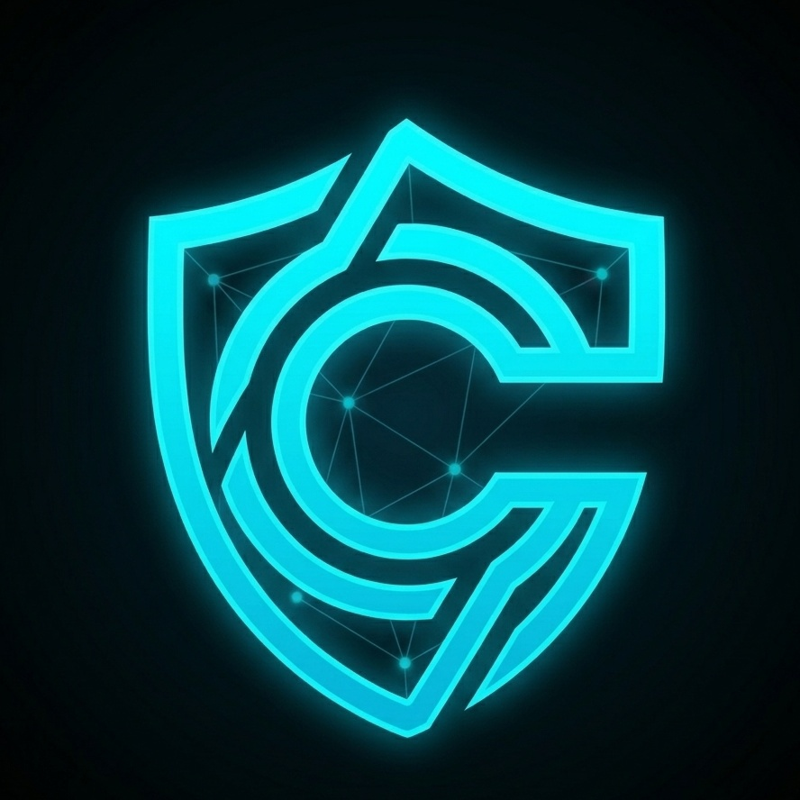

# Cryon Network

**Sovereign Identity for the Trustless Web**

Cryon Network is a decentralized identity (DID) protocol built on Solana, providing the foundational identity layer for users, DAOs, and AI agents.



## Live Site

🌐 [cryonnetwork3.replit.app](https://cryonnetwork3.replit.app)

## Community

- Twitter/X: [@CRYONNETWORK](https://x.com/CRYONNETWORK)
- Discord: [discord.gg/aETwKpNSE](https://discord.gg/aETwKpNSE)
- Telegram: [t.me/cryonnetwork1](https://t.me/cryonnetwork1)

## Features

- **Landing Page** — Hero, features, live network stats
- **Whitepaper** — Full protocol documentation
- **Docs** — Developer integration guides & API reference
- **Blog** — Protocol updates & ecosystem news
- **Metrics Dashboard** — Live TPS, DID growth, network health
- **Governance** — DAO voting portal with on-chain proposals
- **Community** — Social links, events, ecosystem partners
- **Support** — Contact form, FAQ, system status

## Tech Stack

- React + Vite + TypeScript
- Tailwind CSS (dark mode)
- Framer Motion animations
- Recharts for metrics
- Wouter routing
- shadcn/ui components

## Local Development

```bash
pnpm install
pnpm --filter @workspace/cryon-network run dev
```

## Deployment

Automatically deploys to GitHub Pages via GitHub Actions on every push to `main`.

---

© 2026 Cryon Network. All rights reserved.
